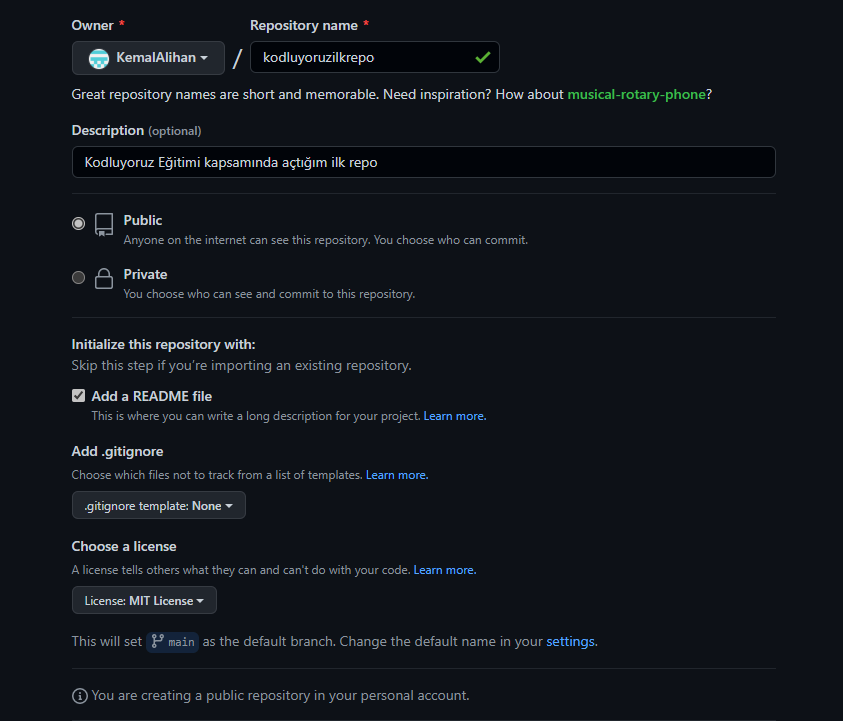

# Kodluyoruz Ilk Repo
[Kodluyoruz](kodluyoruz.org) Front-End eğitiminde oluşturduğumuz ilk repo. İçeriğinde bir adet README dostası, bir adet de index.html barındırıyor.

## Installation
***
Öncelikle projeyi clonelayın. (buraya sizin reponuzun linki gelecek)

```
git clone https://github.com/KemalAlihan/kodluyoruzilkrepo.git
```

## usage
-------------------------------------------------------------------
projeyi cloneladıktan sonra visual studio code da açın.
Linux için:

``` 
cd kodluyoruzilkrepo
code .
```
## contributing
***

pull requestler kabul edilir. büyük değişiklikler için, lütfen önce neyi değiştirmek istediğinizi tartışmak için bir konu açınız.

## Licence
***
[MIT](https://choosealicense.com/licenses/mit/)

